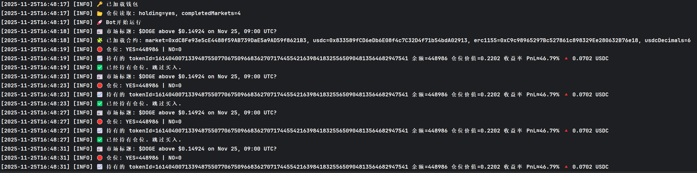

# Limitless Bot — 内置策略的 Limitless 预测市场刷分交易脚本

Telegram： https://t.me/Block_devp
关注我的X：https://x.com/Jlbcode

Limitless官网链接：https://limitless.exchange/?r=3840Y1I1T2

---

⚡ 简介

V1.10.8:更新内容添加15分钟，30分钟，小时场次，在.env文件中FREQUENCY=Minutes 15参数代表对应场次名称，新增MIN_MARKET_AGE_MIN(开盘后入场时间限制)设定10也就是在开盘后10分钟再寻找下单机会

这是一个用于 Limitless 预测市场的自动交易机器人（刷分/做市/示例交易策略），内置了两个简单策略：

- dominant：当某一方价格 >= TRIGGER_PCT（默认 60）时购买该方；
- opposite：当某一方价格在 TRIGGER_PCT 的 TRIGGER_BAND（默认 ±5）范围内时，买入另一方。

脚本会读取 Limitless 的预言机数据并按配置进行买入、止盈、授权及持仓记录等操作。默认配置位于 `.env`，已经在仓库中提供了合理的默认值。

---

📸 运行截图





---

🚀 快速上手（Windows PowerShell）

1. 安装依赖

```powershell
# 进入仓库目录（如果尚未进入）
cd d:\limitless-bot

# 安装依赖
npm install
```

2. 配置环境变量（只需要更改下面两项即可，其他配置默认即可运行）

将仓库根目录下的 `.env` 文件中，修改或填写：

- RPC_URL=：你的 JSON-RPC 节点地址（例如来自 Alchemy、Infura 或自建节点）
- PRIVATE_KEYS=：你的钱包私钥（逗号分隔，示例：PRIVATE_KEYS=0xabc...,0xdef...）

示例（编辑 `.env`）：

```dotenv
RPC_URL=https://your.rpc.node.endpoint
# 你的钱包私钥
PRIVATE_KEYS=0xabcdef0123456789abcdef0123456789abcdef0123456789abcdef0123456789
```

> ⚠️ 安全提示：不要把私钥提交到仓库。请使用 `.env` 或系统环境变量，并确保仓库不包含敏感信息。

3. 运行

```powershell
npm start
# 或者
node src/index.js
```

脚本启动后会输出日志（彩色、带图标），在日志中你可以看到钱包加载、市场信息、是否买入、持仓及 PnL 等信息。

---

🔧 可选参数（均在 `.env` 中，仓库已提供默认值）

尽管只需设置 `RPC_URL` 和 `PRIVATE_KEYS`，下面是一些可选项说明（常用）：

- CHAIN_ID：链 ID（默认 8453）
- PRICE_ORACLE_ID：价格预言机 ID（默认 60）
- FREQUENCY：策略所关注的频率（默认为 hourly）
- BUY_AMOUNT_USDC：每次买入金额（默认 5）
- TARGET_PROFIT_PCT：目标止盈百分比（默认 25）
- STRATEGY_MODE：策略模式（dominant|opposite，默认 dominant）
- TRIGGER_PCT：触发百分比（默认 60）
- TRIGGER_BAND：触发带宽，仅在 opposite 模式生效（默认 5）

若需要更改，直接编辑 `.env` 后重启脚本即可生效。

---

⚠️ 运行风险 & 安全建议

- 本脚本会使用你的钱包发起链上交易（执行 approve、buy、sell 等），请谨慎使用真实资金。
- 建议先用小额资金或在测试环境上验证脚本行为。
- 始终保存私钥安全，避免在公共仓库或截图中暴露私钥。
- 注意网络费用和滑点设置，默认设置为保守值，但请在运行前检查。

---

📦 文件说明

- `src/index.js` — 主入口文件，核心逻辑和策略实现
- `.env` — 配置文件（敏感信息请仅保存在本地）
- `package.json` — 运行脚本/依赖
- `data/state.json` — 运行时的持仓、完成市场记录（由脚本自动维护）
- `src/abis/` — 智能合约 ABI

---

💡 常见问题

1. 启动时报错 RPC_URL/PRIVATE_KEYS 缺失？
   - 请确认 `.env` 中正确设置了 `RPC_URL`、`PRIVATE_KEYS`，或在 PowerShell 中通过临时环境变量设置：

```powershell
$env:RPC_URL='https://your.rpc.node.endpoint'
$env:PRIVATE_KEYS='0xabc...'
npm start
```

2. 为什么脚本没有买入？
   - 请确认`PRICE_ORACLE_ID`、`FREQUENCY` 等设置在预期范围；检查日志（INFO/WARN）找出具体原因。

---

📞 支持与联系

如需帮助或有任何问题，请联系： https://t.me/Block_devp

---

许可证与免责：
- 该脚本仅供示例/研究用途，使用前请自行审慎评估并承担风险。

---

最后更新：2025-11-25
